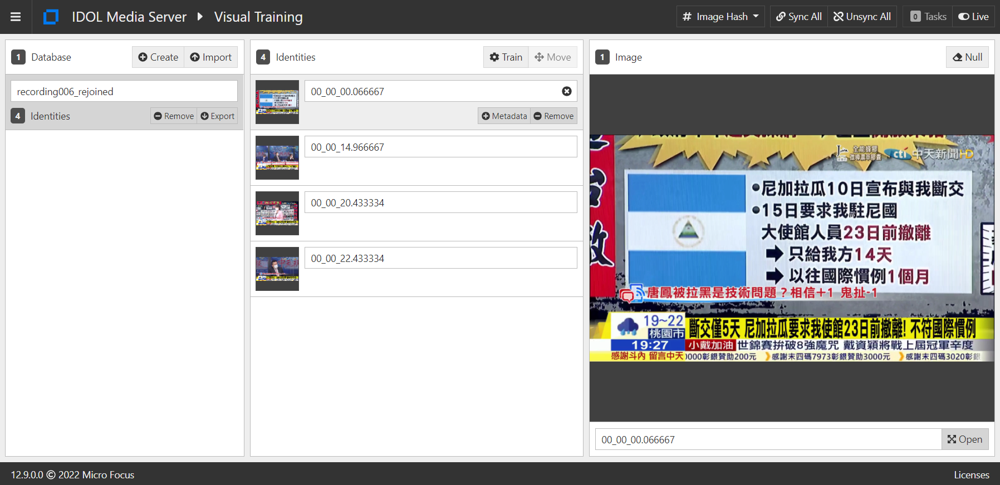

# Video comparison

Two methods can be tried.

## 1. Compare a test video to a Golden Record video.

### Preparation

- Identify keyframes at scene changes in Golden Record video.

   ```
   python process.py ct_news/recording006_rejoined.mp4 target_frames.cfg
   ```

   > NOTE: Since Media Server's [KeyFrame](https://www.microfocus.com/documentation/idol/IDOL_12_10/MediaServer_12.10_Documentation/Guides/html/index.html#Operations/Analyze/Keyframes_intro.htm%3FTocPath%3DAnalyze%2520Media%7CExtract%2520Keyframes%7C_____0) analysis does not trigger on monochrome frames, we also use Color Cluster to identify any monochrome scene changes.

- Train keyframes from Golden Record video using Media Server's [ImageHash](https://www.microfocus.com/documentation/idol/IDOL_12_10/MediaServer_12.10_Documentation/Guides/html/index.html#Operations/Analyze/ImageHash_overview.htm%3FTocPath%3DAnalyze%2520Media%7CGenerate%2520Image%2520Hashes%7C_____1).

   ```
   python train_image_hash.py target_frames/recording006_rejoined
   ```

- Train Media Server's [Image Classification](https://www.microfocus.com/documentation/idol/IDOL_12_10/MediaServer_12.10_Documentation/Guides/html/index.html#Training/ImageClass_Train.htm%3FTocPath%3DAnalyze%2520Media%7CImage%2520Classification%7CTrain%2520Media%2520Server%2520to%2520Classify%2520Images%7C_____0) with example frames for each expected class of error, *e.g.* using the Media Server GUI.

   > Prior to creating this training set, we will import the sample classifier `ImageClassifier_Imagenet` to test the workflow.

## Processing

- Identify keyframes at scene changes in Golden Record video:

   ```
   python process.py ct_news/recording006_rejoined.mp4 target_frames.cfg
   python process.py ct_news/recording006_blue100.mp4 target_frames.cfg
   python process.py ct_news/recording006_testcard150.mp4 target_frames.cfg
   ```

   > For a first test, we will compare against three videos:
   > 1. The Golden Record video itself.
   > 1. A version of the video with blue frames replacing original frames at random intervals (replacement likelihood 1 in 100).
   > 1. A version of the video with testcard frames replacing original frames at random intervals (replacement likelihood 1 in 150).

- Attempt to pair keyframes from test video with those from golden record video, using a threshold confidence on ImageHash match.
- Expect any unpaired frames from the test video to be errors.  Attempt to classify unpaired frames.

   ```
   python pair_target_frames.py target_frames/recording006_rejoined 80
   python pair_target_frames.py target_frames/recording006_blue100 80
   python pair_target_frames.py target_frames/recording006_testcard150 80
   ```

## Sample video preparation

### Data collection

Follow steps from our [tutorial](https://github.com/microfocus-idol/idol-rich-media-tutorials/blob/master/tutorials/appendix/Media_tips.md#record-videoaudio-from-a-live-youtube-channel).

Looking for live streams from the channels listed here:
https://en.wikipedia.org/wiki/Category:24-hour_television_news_channels_in_Taiwan

#### Download video from Chung_T'ien_Television

https://www.ctitv.com.tw/
https://www.youtube.com/channel/UC5l1Yto5oOIgRXlI4p4VKbw

Live stream: https://www.youtube.com/watch?v=lu_BJKxqGnk

```bsh
$ youtube-dl.exe -F https://www.youtube.com/watch?v=lu_BJKxqGnk
[youtube] lu_BJKxqGnk: Downloading webpage
[youtube] lu_BJKxqGnk: Downloading m3u8 information
[youtube] lu_BJKxqGnk: Downloading MPD manifest
[info] Available formats for lu_BJKxqGnk:
format code  extension  resolution note
91           mp4        256x144     290k , avc1.42c00b, 15.0fps, mp4a.40.5
92           mp4        426x240     546k , avc1.4d4015, 30.0fps, mp4a.40.5
93           mp4        640x360    1209k , avc1.4d401e, 30.0fps, mp4a.40.2
94           mp4        854x480    1568k , avc1.4d401f, 30.0fps, mp4a.40.2
95           mp4        1280x720   2969k , avc1.4d401f, 30.0fps, mp4a.40.2
96           mp4        1920x1080  5420k , avc1.640028, 30.0fps, mp4a.40.2 (best)
```

```
mkdir ct_news
ffmpeg -i $(youtube-dl -f 95 https://www.youtube.com/watch?v=lu_BJKxqGnk --get-url) -f segment -segment_time 30 ct_news/recording%03d.mp4
```

#### Check the properties of source video

```
$ ffprobe ct_news/recording006.mp4
Stream #0:0(und): Video: h264 (High) (avc1 / 0x31637661), yuv420p, 1280x720 [SAR 1:1 DAR 16:9], 1752 kb/s, 30 fps
```

Frame rate | Resolution | Codec
--- | --- | ---
30 | 1280x720 | h264

### Manipulate Golden Record video

#### Insert random frames into video

1. Generate a monochrome frame using [`ImageMagick`](https://imagemagick.org/index.php):

    ```
    convert -size 1280x720 canvas:blue blue.png
    ```

1. Grab the first frame from a testcard video using `ffmpeg`:

    ```
    ffmpeg -f lavfi -i testsrc=d=5:s=1280x720:r=1,format=yuv420p -frames:v 1 testcard.png
    ```

1. Use the included python script to split video into frames at full frame rate (30 fps):

    ```
    python extract_stills.py 30 ct_news/recording006.mp4
    ```

1. Use the included python script to replace some frames with monochrome or testcard frames of same size:

    ```
    python replace_stills.py 30 ct_news/recording006.mp4 blue 100
    ```

1. Use the included python script to rejoin frames to produce a video:

    ```
    python join_stills.py 30 ct_news/recording006.mp4 blue100
    ```

> To generate the test files, run the following steps in sequence:
> ```
> python extract_stills.py 30 ct_news/recording006.mp4
> python join_stills.py 30 ct_news/recording006.mp4 rejoined
> python replace_stills.py 30 ct_news/recording006.mp4 blue 100
> python join_stills.py 30 ct_news/recording006.mp4 blue100
> python extract_stills.py 30 ct_news/recording006.mp4
> python replace_stills.py 30 ct_news/recording006.mp4 testcard 150
> python join_stills.py 30 ct_news/recording006.mp4 testcard150
> ```

## Preliminary results

Golden Record `recording006` contains 4 keyframes:



Run pairing script, with a threshold to pair of `80`:

```
python pair_target_frames.py target_frames/recording006_rejoined 80
python pair_target_frames.py target_frames/recording006_blue100 80
python pair_target_frames.py target_frames/recording006_testcard150 80
```

Test video | Keyframes | Paired keyframes | Unpaired keyframes | Unpaired keyframes correctly classified
--- | --- | --- | --- | ---
recording006_rejoined | 4 | 4 | 0 | - 
recording006_blue100 | 9 | 4 | 5 | 5 
recording006_testcard150 | 16 | 4 | 11 | - 

> Before creating error class training, we can only attempt to verify classification of monochrome frames.

Summary:
- Pairing accuracy 100%
- Error classification accuracy 100% for monochrome frames
- Error classification for common error types TBD

## Next Steps

- Collect sample frames for expected error types to train Image Classification.
- Test this method on more sample clips, *i.e.* more Golden Record videos.
- Test this method using additional manipulations of the Golden Record video, such as:
  - remuxed
  - transcoded
  - resized
  - replace frames inserted at random timestamps
  - split and put back

- Attempt Method 2: once Image Classifier has been trained, run it directly on a text video to look from problem frames directly.
